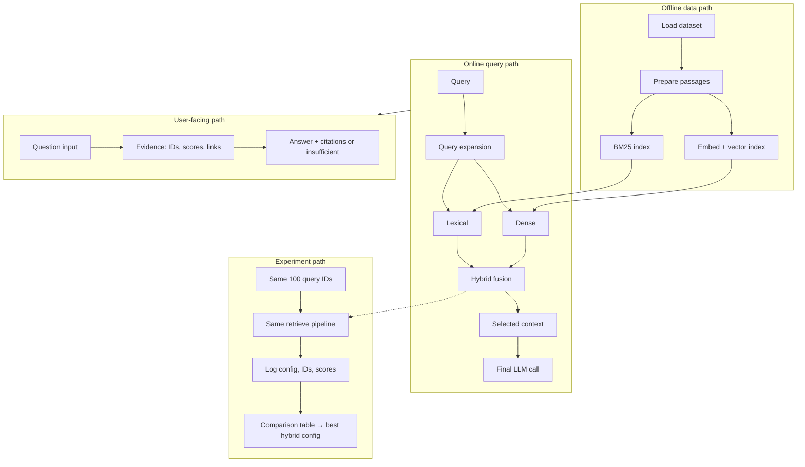

# BioMed Hybrid Search

A grounded search and question-answering system for biomedical literature. Users ask a question, see ranked evidence passages, and get an LLM answer that may cite only those passages. If the model invents citations or cannot support a claim, the UI shows **insufficient evidence**.

| | |
|---|---|
| UI | [http://localhost:5269](http://localhost:5269) |
| API | [http://localhost:5268](http://localhost:5268) · OpenAPI at `/docs` |

---

## What it does

1. Optionally expands the query with an LLM (original query is always kept).
2. Retrieves passages with BM25, dense vectors, or a hybrid of both (weighted or RRF fusion).
3. Shows ranked evidence with passage IDs, scores, and PubMed links.
4. Generates a grounded answer with inline `[passage_id]` citations, validated in code.

Interactive search defaults to **weighted hybrid**, expansion **off** (~80 ms retrieval). Enable expansion when you want higher recall.

---

## Data source

Corpus and questions come from Hugging Face: [`rag-datasets/rag-mini-bioasq`](https://huggingface.co/datasets/rag-datasets/rag-mini-bioasq).

| Split | Size | Fields used |
|---|---:|---|
| `text-corpus` / `passages` | 40,221 | `id`, `passage` |
| `question-answer-passages` / `test` | 4,719 | `id`, `question`, `answer`, `relevant_passage_ids` |

Gold passage IDs are used only for offline scoring, never at query time. A frozen 100-query subset (`data/eval_queries_100.json`, seed 42) mixes yes/no, definition, list, treatment, mechanism, and effect questions.

Set `HF_TOKEN` in `.env` if the Hub requires auth.

---

## Architecture



Full diagram: **[docs/architecture.md](docs/architecture.md)**.

### Main choices

| Choice | Decision |
|---|---|
| Vector database | Pinecone serverless (default) or Qdrant via `VECTOR_DB` |
| Embedding model | `BAAI/bge-base-en-v1.5` (768-d), set in `.env` |
| Fusion | Weighted (default; higher nDCG here) and RRF |
| Final-answer model | OpenRouter or Ollama (`LLM_PROVIDER`) |
| Citation validation | [`backend/app/generation/answer.py`](backend/app/generation/answer.py) — cited IDs must be retrieved IDs |

These are `.env` switches, not code forks. Changing the embedder requires `make index`.

---

## How to run

**Requirements:** Python 3.11+, Node 20+, a vector store (Pinecone key or local Qdrant), and an LLM (OpenRouter key or [Ollama](https://ollama.com)).

```bash
cp .env.example .env          # set VECTOR_DB, LLM_PROVIDER, and keys
make install
make index                    # BM25 pickle + vector upsert (~40k passages)
make restart                  # start API + UI on .env ports
```

Then open **http://localhost:5269** (API **http://localhost:5268**). Defaults: `BACKEND_PORT=5268`, `FRONTEND_URL=http://localhost:5269`.

```bash
./scripts/restart.sh          # kill those ports and start again
./scripts/restart.sh --kill   # stop only
```

### Evaluate

```bash
make eval-setup               # freeze 100 queries (already in the repo)
make eval-run                 # lexical, dense, hybrid, expansion
make eval-report              # docs/evaluation_report.md + docs/best_hybrid_config.json
make test
```

---

## Findings

Same 100 query IDs for every config.

| Config | nDCG@10 | Recall@10 | Latency |
|---|---:|---:|---:|
| Lexical (BM25) | 0.481 | 0.391 | 57 ms |
| Dense | 0.588 | 0.469 | 33 ms |
| Hybrid RRF | 0.583 | 0.478 | 81 ms |
| Hybrid weighted | 0.607 | 0.495 | 82 ms |
| **Hybrid + expansion** | **0.632** | **0.518** | ~27 s |

Expansion is the best **ranker**. The LLM judge (20 queries) preferred **weighted hybrid** for correctness (0.75 vs 0.58) and groundedness (0.80 vs 0.51). Extra recall costs one LLM round-trip. Local Ollama is $0; hosted models accrue `cost_usd`.

Full table, judge scores, and examples: **[docs/evaluation_report.md](docs/evaluation_report.md)**. Chosen recipe: **[docs/best_hybrid_config.json](docs/best_hybrid_config.json)**. Runner: **[backend/scripts/run_evaluation.py](backend/scripts/run_evaluation.py)**.

---

## Repository

```
backend/app/          API, retrieval, generation, metrics
backend/scripts/      index, eval set, runner, report
frontend/src/        search UI
data/eval_queries_100.json
docs/                requirements, architecture, evaluation report, best config
```

| Document | Contents |
|---|---|
| [docs/requirement.md](docs/requirement.md) | Product requirements |
| [docs/architecture.md](docs/architecture.md) | System diagram |
| [docs/evaluation_report.md](docs/evaluation_report.md) | Comparison table, winner, examples |
| [docs/best_hybrid_config.json](docs/best_hybrid_config.json) | Selected retrieval recipe |
| [backend/scripts/run_evaluation.py](backend/scripts/run_evaluation.py) | Reproducible 100-query runner |
| [specs.md](specs.md) | Interfaces and implementation notes |
| [summary.md](summary.md) | Design decisions |
