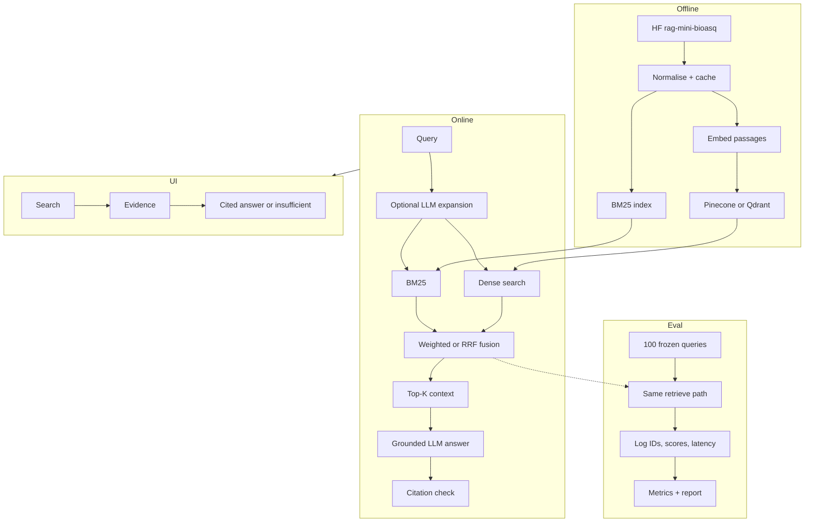

# BioMed Hybrid Search

A grounded search and question-answering system for biomedical literature. Users ask a question, see ranked evidence passages, and get an LLM answer that may cite only those passages. If the model invents citations or cannot support a claim, the UI shows **insufficient evidence**.

| | |
|---|---|
| UI | [http://localhost:5269](http://localhost:5269) |
| API | [http://localhost:5268](http://localhost:5268) · OpenAPI at `/docs` |

---

## What it does

1. Optionally expands the query with an LLM (original query is always kept).
2. Retrieves passages with BM25, dense vectors, or a hybrid of both (weighted or RRF fusion).
3. Shows ranked evidence with passage IDs, scores, and PubMed links.
4. Generates a grounded answer with inline `[passage_id]` citations, validated in code.

Interactive search defaults to **weighted hybrid**, expansion **off** (~80 ms retrieval). Enable expansion when you want higher recall.

---

## Data source

Corpus and questions come from Hugging Face: [`rag-datasets/rag-mini-bioasq`](https://huggingface.co/datasets/rag-datasets/rag-mini-bioasq).

| Split | Size | Fields used |
|---|---:|---|
| `text-corpus` / `passages` | 40,221 | `id`, `passage` |
| `question-answer-passages` / `test` | 4,719 | `id`, `question`, `answer`, `relevant_passage_ids` |

Gold passage IDs are used only for offline scoring, never at query time. A frozen 100-query subset (`data/eval_queries_100.json`, seed 42) mixes yes/no, definition, list, treatment, mechanism, and effect questions.

Set `HF_TOKEN` in `.env` if the Hub requires auth.

---

## Architecture



Indexes are built once, then shared by the UI and the 100-query runner. Notes and the full diagram: **[docs/architecture.md](docs/architecture.md)**.

### Configurable stack

Providers, models, and fusion are **`.env` switches**, not code forks. Retrieval, the UI, and eval all read the same settings.

| Knob | How to switch | Default | Why this default |
|---|---|---|---|
| Vector store | `VECTOR_DB=pinecone` or `qdrant` | Pinecone serverless | Managed index, free-tier friendly, no local disk for 40k vectors. Qdrant is the offline/dev path. |
| Embeddings | `EMBEDDING_MODEL` + matching `EMBEDDING_DIM` | `BAAI/bge-base-en-v1.5` (768-d) | Strong general English retrieval at a size that indexes quickly. Swap MiniLM (384) or bge-large (1024) and re-run `make index`. |
| LLM | `LLM_PROVIDER=openrouter` or `ollama` | OpenRouter (cloud) | One OpenAI-compatible client for expansion, answers, and the judge. Ollama for local/zero-cost runs (`OLLAMA_MODEL`). |
| Fusion | UI control, or `FUSION_METHOD` | Weighted | Beat RRF on this corpus (nDCG 0.607 vs 0.583). RRF stays as a rank-robust option. |
| Expansion | UI toggle; `QUERY_EXPANSION_ENABLED` | Off in the UI | Highest recall when on; ~27 s/query locally. Interactive search stays ~80 ms without it. |

Citation checks stay in code regardless of provider: [`backend/app/generation/answer.py`](backend/app/generation/answer.py).

---

## How to run

**Requirements:** Python 3.11+, Node 20+, a vector store (Pinecone key or local Qdrant), and an LLM (OpenRouter key or [Ollama](https://ollama.com)).

```bash
cp .env.example .env          # set VECTOR_DB, LLM_PROVIDER, and keys
make install
make index                    # BM25 pickle + vector upsert (~40k passages)
make restart                  # start API + UI on .env ports
```

Then open **http://localhost:5269** (API **http://localhost:5268**). Defaults: `BACKEND_PORT=5268`, `FRONTEND_URL=http://localhost:5269`.

```bash
./scripts/restart.sh          # kill those ports and start again
./scripts/restart.sh --kill   # stop only
```

### Evaluate

```bash
make eval-setup               # freeze 100 queries (already in the repo)
make eval-run                 # lexical, dense, hybrid, expansion
make eval-report              # docs/evaluation_report.md
make output                   # snapshot artifacts into output/
make test
```

---

## Findings

Same 100 query IDs for every config.

| Config | nDCG@10 | Recall@10 | Latency |
|---|---:|---:|---:|
| Lexical (BM25) | 0.481 | 0.391 | 57 ms |
| Dense | 0.588 | 0.469 | 33 ms |
| Hybrid RRF | 0.583 | 0.478 | 81 ms |
| Hybrid weighted | 0.607 | 0.495 | 82 ms |
| **Hybrid + expansion** | **0.632** | **0.518** | ~27 s |

Expansion is the best **ranker**. The LLM judge (20 queries) preferred **weighted hybrid** for correctness (0.75 vs 0.58) and groundedness (0.80 vs 0.51). Extra recall costs one LLM round-trip. Local Ollama is $0; hosted models accrue `cost_usd`.

Full table, judge scores, and examples: **[docs/evaluation_report.md](docs/evaluation_report.md)**. Chosen recipe: **[output/best_hybrid_config.json](output/best_hybrid_config.json)**.

---

## Repository

```
backend/app/          API, retrieval, generation, metrics
backend/scripts/      index, eval set, runner, report
frontend/src/        search UI
data/eval_queries_100.json
docs/                architecture, evaluation report
output/              frozen eval snapshots
```

| Document | Contents |
|---|---|
| [docs/architecture.md](docs/architecture.md) | Detailed system diagram |
| [docs/evaluation_report.md](docs/evaluation_report.md) | Metrics, examples, trade-offs |
| [output/](output/) | Eval set, runner, per-config results |
| [specs.md](specs.md) | Interfaces and implementation notes |
| [summary.md](summary.md) | Design decisions |
