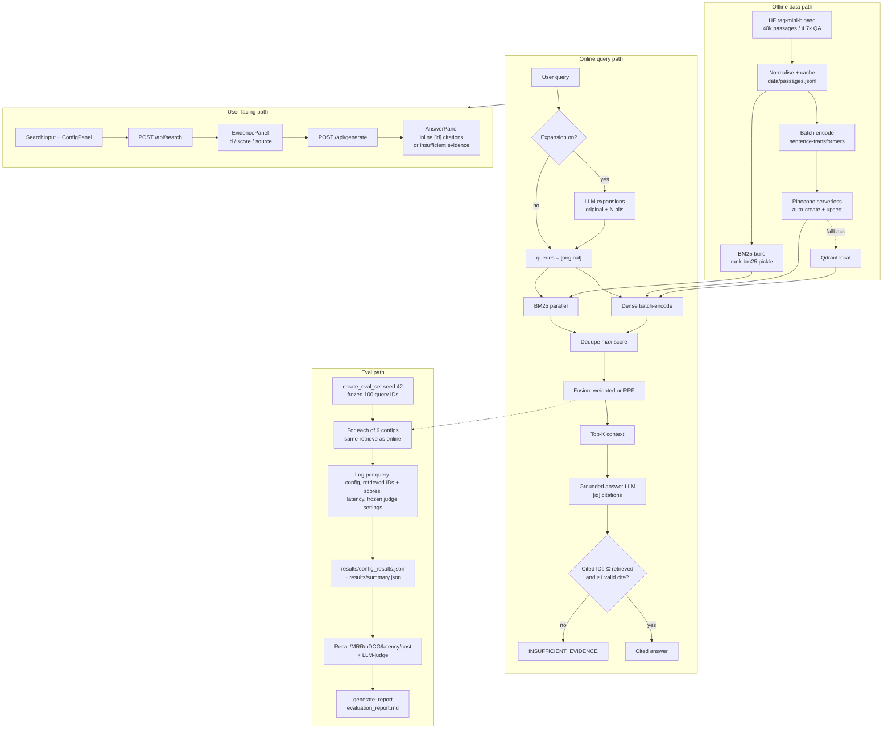

# Architecture

BioMed Hybrid Search indexes BioASQ passages once, then serves the same retrieval stack to the UI and to the 100-query benchmark.

## Diagram

Offline indexes feed both interactive search and the eval runner. `run_evaluation.py` uses the same expansion → BM25/dense → fusion path as `POST /api/search`. Judge prompt, model, and temperature stay fixed in `.env`. Every search records passage IDs and scores; aggregates become the comparison table and the selected hybrid recipe.

## Design notes

Nothing in the retrieve/generate path is hard-wired to one vendor. `.env` selects the store, embedder, and LLM; changing the embedder requires `make index`.

- **Vector store.** `VECTOR_DB=pinecone` (default) for a managed serverless index with auto-create and a dimension check. `VECTOR_DB=qdrant` for local Docker. Pinecone avoids operating 40k vectors on disk; Qdrant keeps the stack runnable without a cloud key.
- **Embeddings.** `EMBEDDING_MODEL` (default `BAAI/bge-base-en-v1.5`, 768-d) is a solid English dense baseline. Set `EMBEDDING_DIM` to match; mismatch fails fast. MiniLM / bge-large work after a re-index.
- **Fusion.** Weighted min-max is the UI default because it won nDCG vs RRF on this set. RRF remains available (`FUSION_METHOD=rrf` or the UI).
- **LLM.** `LLM_PROVIDER=openrouter` or `ollama`, same client for expansion, answers, and the judge. Cloud for quality/variety of models; Ollama for local, $0 inference.
- **Citations.** Independent of the LLM: regex `\[(\d+)\]` in `backend/app/generation/answer.py`. Bad or missing cites become `INSUFFICIENT_EVIDENCE`.
- **Latency.** Expansion off by default; evidence from `/search` appears before `/generate` returns.
