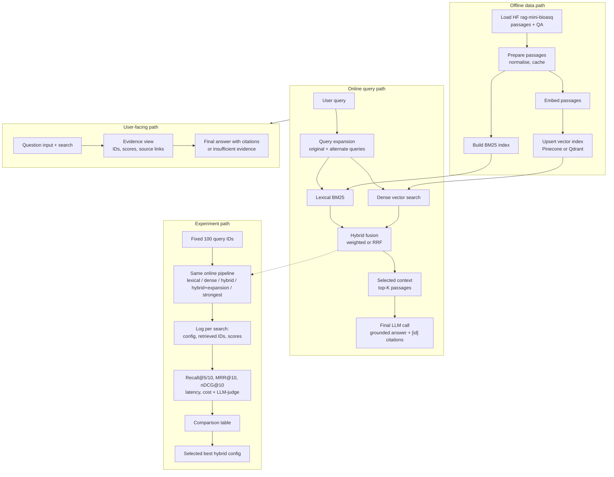

# Architecture

System design for BioMed Hybrid Search over `rag-datasets/rag-mini-bioasq`. The four paths below match the required diagram: offline data, online query, user-facing UI, and experiment (100-query eval on the same pipeline).

## Diagram

The experiment runner (`backend/scripts/run_evaluation.py`) reuses the online retrieve path. Every search records passage IDs and scores. Offline indexes are built once and shared by the UI and the 100-query runs.

How those pieces call each other, and how Recall / MRR / nDCG / judges are computed: **[code-understanding.md](code-understanding.md)**.

## Main choices

| Choice | What we use | Why |
|---|---|---|
| Vector database | Pinecone serverless, or Qdrant (`VECTOR_DB`) | Managed 40k-vector index by default; Qdrant when running fully local. |
| Embedding model | `BAAI/bge-base-en-v1.5` (768-d), `.env` | Strong English retrieval at a size that indexes quickly. Re-index after a swap. |
| Fusion | Weighted min-max (default) and RRF | Weighted won nDCG on this set; RRF stays as the rank-robust option. |
| Final-answer model | OpenRouter or Ollama (`LLM_PROVIDER`) | Same client for expansion, answers, and the judge. Ollama for local / $0. |
| Citation validation | `backend/app/generation/answer.py` | Cited IDs must be a non-empty subset of retrieved IDs; otherwise **insufficient evidence**. |

## Experiment results → best config

Required configs on the **same 100 query IDs**: lexical, dense, hybrid, hybrid + query expansion, and the strongest variant (`best` = weighted hybrid + expansion).

Selection uses the comparison table (Recall, MRR, nDCG, latency, cost). **`hybrid_expansion` won** on nDCG@10 (0.632) and Recall@10 (0.518). Trade-off: ~27 s/query vs ~80 ms without expansion.

LLM-judge (correctness, groundedness, context relevance) is the second scoring layer, with prompt/model/temperature fixed. It was run on a 20-query subset for cost (`results/judge/`). Those scores are in the report for disagreement review; they do not replace the 100-query table as the basis for the selected config.
